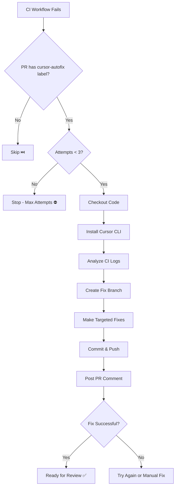

# Auto-Fix CI Setup Guide

> Automated CI failure fixes using Cursor AI Agent

## Overview

The `auto-fix-ci.yml` workflow automatically analyzes and fixes CI failures using Cursor's AI agent. It's designed with safety guardrails to prevent runaway costs and infinite loops.

## Features

✅ **Label-Gated**: Only runs when PR has the `cursor-autofix` label  
✅ **Attempt Limit**: Maximum 3 fix attempts per PR  
✅ **Targeted Fixes**: Makes minimal changes to fix only the failing checks  
✅ **Safe Branches**: Creates separate fix branches (`ci-fix/branch-name`) for review  
✅ **Clear Communication**: Posts PR comments with fix summaries and next steps  

## Setup

### 1. Get Cursor API Key

1. Sign in to [Cursor Dashboard](https://cursor.com/dashboard)
2. Navigate to **Settings** → **API Keys**
3. Click **Generate New API Key**
4. Copy the key (you won't see it again)

### 2. Add GitHub Secret

1. Go to your GitHub repository
2. Navigate to **Settings** → **Secrets and variables** → **Actions**
3. Click **New repository secret**
4. Name: `CURSOR_API_KEY`
5. Value: Paste your Cursor API key
6. Click **Add secret**

### 3. Enable the Workflow

The workflow is automatically enabled once the `auto-fix-ci.yml` file is merged to your main branch.

## Usage

### Enable Auto-Fix for a PR

1. Open a pull request
2. Wait for CI to run and fail
3. Add the `cursor-autofix` label to the PR
4. The auto-fix workflow will trigger on the next CI failure


### What Happens Next

1. **Analysis**: Cursor agent analyzes the CI failure logs
2. **Fix**: Creates targeted fixes in a new branch `ci-fix/your-branch`
3. **Comment**: Posts a summary on the PR with:
   - What failed
   - What was fixed
   - How to review and merge the fix
   - Remaining attempts

### Review and Merge Fixes

```bash
# Fetch the fix branch
git fetch origin ci-fix/your-branch

# Review the changes
git diff HEAD..origin/ci-fix/your-branch

# If good, merge into your branch
git merge origin/ci-fix/your-branch

# Push the updated branch
git push
```

### Disable Auto-Fix

Remove the `cursor-autofix` label from the PR at any time.

## Guardrails

### Attempt Limit (3 max)

The workflow tracks attempts via PR comments. After 3 attempts:

```
⛔ Maximum fix attempts (3) reached for this PR

Manual intervention required. Consider:
  1. Review the previous fix attempts
  2. Fix the issues manually
  3. Remove and re-add the 'cursor-autofix' label to reset counter (use with caution)
```

**Resetting the counter:**  
Remove all auto-fix comments from the PR, then remove and re-add the label. Use sparingly - if the agent couldn't fix it in 3 tries, it likely needs human judgment.

### Label Requirement

Without the `cursor-autofix` label, the workflow skips execution:

```
⏭️ Skipping auto-fix: PR doesn't have 'cursor-autofix' label
To enable auto-fix, add the 'cursor-autofix' label to the PR
```

### Branch Isolation

All fixes are made on separate branches (`ci-fix/*`) so you can:
- Review changes before merging
- Reject bad fixes without polluting your branch
- Compare multiple fix attempts

## How It Works



## CI Checks Monitored

The workflow monitors the **"Validate PRs"** workflow, which includes:

- **Lint**: Biome code quality checks
- **Type-check**: TypeScript compilation
- **Boundary-checks**: UI/DB separation rules
- **Build**: Production build verification
- **Prod-mock-ban**: No test mocks in production code
- **E2E**: Playwright end-to-end tests

## Project-Specific Rules

The agent is instructed to follow project conventions:

- ✅ Read `AGENTS.md` and `.cursor/rules/` for patterns
- ✅ Never import `@repo/database` in `apps/web` (use `@repo/api` instead)
- ✅ No MSW/mock imports in source code (tests only)
- ✅ Follow existing code style and patterns
- ✅ Make minimal, targeted changes

## Troubleshooting

### "CURSOR_API_KEY not set"

**Problem**: The workflow fails immediately with a missing API key error.

**Solution**:
1. Verify the secret exists: Settings → Secrets and variables → Actions
2. Check the name is exactly `CURSOR_API_KEY` (case-sensitive)
3. Re-add the secret if needed

### "Rate limit exceeded"

**Problem**: Too many requests to Cursor API.

**Solution**:
- Wait a few minutes and retry
- Check your [Cursor Dashboard](https://cursor.com/dashboard) for usage limits
- Consider upgrading your Cursor plan if you hit limits frequently

### "Could not create fix branch"

**Problem**: Git conflicts or permission issues.

**Solution**:
1. Ensure your branch is up-to-date with base branch
2. Check for existing `ci-fix/*` branches and delete if stale
3. Verify the workflow has `contents: write` permission

### Agent Couldn't Fix the Issue

**Problem**: After 3 attempts, still failing.

**Solution**:
- Review the fix attempts in the PR comments
- The issue likely requires human judgment or design decisions
- Check the CI logs manually: may be config, env, or architectural issues

### Fix Created Wrong Changes

**Problem**: The agent made incorrect or excessive changes.

**Solution**:
1. Don't merge the fix branch
2. Delete it: `git push origin --delete ci-fix/your-branch`
3. Add more context to the PR description about what's failing
4. Remove/re-add the label to try again with clearer context

## Cost Management

### Estimate Costs

- Each fix attempt uses Cursor credits
- Cost depends on:
  - Complexity of the failure
  - Size of codebase analyzed
  - Model used (configured as GPT-5)

### Minimize Costs

1. **Use labels judiciously**: Only enable for PRs that benefit from automation
2. **Fix obvious issues manually**: Save credits for complex failures
3. **Monitor attempts**: Review after first attempt; disable if going wrong
4. **Set up monitoring**: Track usage in Cursor Dashboard

### Budget Guardrails

Current settings:
- Max 3 attempts per PR
- Requires explicit label (no auto-enabling)
- Single workflow monitored (Validate PRs only)

To add more guardrails:
- Add org-level budget limits in Cursor Dashboard
- Set up usage alerts
- Restrict to specific repos or branches

## Best Practices

### When to Use

✅ **Good candidates:**
- Type errors after dependency updates
- Linting issues (formatting, imports)
- Simple build failures
- Test failures with clear error messages
- Boundary violations (e.g., wrong imports)

❌ **Poor candidates:**
- Complex logic bugs requiring design decisions
- Performance issues
- Security vulnerabilities
- Flaky tests
- Infrastructure/environment issues

### PR Description Tips

Help the agent by including context in PR descriptions:

```markdown
## Changes
- Updated React to v19
- Migrated form components to new API

## Known Issues
- Types failing in UserForm.tsx due to React 19 type changes
- Need to update FormProps interface
```

### Review Checklist

Before merging auto-fixes:

- [ ] Changes are minimal and targeted
- [ ] No unrelated code was modified
- [ ] Follows project conventions
- [ ] All tests pass locally
- [ ] No security concerns introduced

## Advanced Configuration

### Customize Attempt Limit

Edit `.github/workflows/auto-fix-ci.yml`:

```yaml
const MAX_ATTEMPTS = 5;  # Change from 3 to 5
```

### Monitor Additional Workflows

Add more workflows to the trigger:

```yaml
on:
  workflow_run:
    workflows: ["Validate PRs", "E2E Tests", "Deploy Preview"]
    types: [completed]
```

### Change Branch Prefix

```yaml
env:
  BRANCH_PREFIX: autofix  # Changes ci-fix/branch to autofix/branch
```

### Use Different Model

```yaml
env:
  MODEL: gpt-4-turbo  # or claude-3-opus, etc.
```

## Support

### Getting Help

1. **Check workflow logs**: Actions tab → Auto-fix CI Failures → View run
2. **Review PR comments**: Agent explains what it tried
3. **Cursor Forum**: [forum.cursor.com](https://forum.cursor.com)
4. **Cursor Support**: [hi@cursor.com](mailto:hi@cursor.com)

### Providing Feedback

When reporting issues:
- Include workflow run URL
- Share relevant PR comments
- Describe expected vs actual behavior
- Note if issue is consistent or intermittent

## Examples

### Example 1: Type Error Fix

**CI Failure:**
```
Type 'string | undefined' is not assignable to type 'string'
```

**Agent Fix:**
```typescript
// Before
const name = user?.name;

// After
const name = user?.name ?? '';
```

**Result:** ✅ Fixed in 1 attempt

### Example 2: Import Boundary Violation

**CI Failure:**
```
Found DB/Prisma imports in apps/web
Rule: apps/web must NOT import Prisma or DB internals
```

**Agent Fix:**
```typescript
// Before
import { db } from '@repo/database';

// After
import { orpcClient } from '@shared/lib/orpc-client';
// Use API procedures instead of direct DB access
```

**Result:** ✅ Fixed in 1 attempt

### Example 3: Complex Logic Bug

**CI Failure:**
```
E2E test failed: Login flow redirects to wrong page
```

**Agent Response:**
```
⚠️ This appears to require design decisions about routing logic.
I can see the test failure but the correct redirect target depends 
on business requirements. Manual review needed.
```

**Result:** ⚠️ No fix attempted - flagged for human review

## FAQ

**Q: Does this work with other CI systems (CircleCI, Jenkins, etc.)?**  
A: Currently GitHub Actions only. The workflow uses GitHub-specific APIs.

**Q: Can it fix E2E test failures?**  
A: Sometimes. It works well for simple E2E failures (selector changes, timing) but not complex behavioral issues.

**Q: Will it make breaking changes?**  
A: No. The agent is instructed to make minimal fixes. All changes go to a review branch first.

**Q: How long does a fix attempt take?**  
A: Typically 2-5 minutes, depending on failure complexity and codebase size.

**Q: Can I use this on private repos?**  
A: Yes, with a Cursor Pro or Enterprise plan.

**Q: What if I don't have a Cursor subscription?**  
A: You need a Cursor account with API access. Check [pricing](https://cursor.com/pricing).

---

**Last Updated**: 2026-01-30  
**Version**: 1.0  
**Maintainer**: BackBox Team
